# Rust Deployment Worker Implementation Plan

This plan details the design and implementation of the **DeployNest Rust Worker**. The worker is responsible for polling the PostgreSQL database for pending deployment jobs, cloning application repositories, building Docker images, running Docker containers, allocation of ports, and streaming build/run logs to the database in real-time.

## User Review Required

> [!IMPORTANT]
> The worker relies on system CLI dependencies. The host machine running this worker **must** have `git` and `docker` installed and configured in the system PATH. Additionally, the user under which the worker runs must have permissions to run `docker` commands without `sudo` (e.g., being part of the `docker` group).

## Proposed Architecture

We will implement the worker using **Tokio** for async execution, **SQLx** for database connection and transactions, and **Tokio's process modules** to run CLI commands asynchronously. This design avoids heavy and error-prone native C-binding compilations (like `libgit2` or `libdocker`), ensuring high portability and ease of maintenance.

### 1. Job Orchestration Flow

```mermaid
sequenceDiagram
    participant DB as PostgreSQL Database
    participant W as Rust Worker
    participant Git as Git CLI
    participant Dock as Docker CLI

    loop Poll Interval (e.g., every 5s)
        W->>DB: Fetch PENDING job & LOCK (transaction)
        Note over W,DB: Status updated to 'running'
    end

    rect rgb(30, 41, 59)
        Note over W: Prepare Workspace Directory
        W->>Git: git clone --branch <branch> --depth 1 <url> <path>
        Git-->>W: Stream stdout/stderr
        W->>DB: Save log lines in real-time

        W->>Dock: docker build -t deploynest-<project_id>:<deployment_id>
        Dock-->>W: Stream stdout/stderr
        W->>DB: Save log lines in real-time

        Note over W: Find available port on host
        Note over W: Stop & Remove old container if exists
        W->>Dock: docker run -d -p <host_port>:<container_port>
        Dock-->>W: Return Container ID

        W->>DB: Update deployment (success, container_id, port)
        W->>DB: Update job (completed)
    end
```



---

## Proposed Changes

### [Rust Deployment Worker]

We will build the worker within the `Deploynestworker` directory.

#### [MODIFY] [Cargo.toml](file:///Users/limburoshan/Code/DN/Deploynestworker/Cargo.toml)

We will add required dependencies:

- `tokio` (async engine)
- `sqlx` (async Postgres driver)
- `dotenvy` (loading `.env` variables)
- `chrono` (date and time helper matching Drizzle's database timestamps)
- `anyhow` (flexible error handling)
- `futures-util` (for stream processing of logs)

#### [NEW] [main.rs](file:///Users/limburoshan/Code/DN/Deploynestworker/src/main.rs)

The core logic will be organized into logical helper functions within `main.rs`:

- **`main`**: Bootstraps the application, connects to Postgres, and runs the main loop.
- **`poll_and_process_jobs`**: Runs a database transaction to pick up a pending job and spawn the build process.
- **`process_deployment`**: Performs the sequence of deployment tasks (clone, build, run, clean up).
- **`execute_command_with_logs`**: Spawns processes (Git/Docker), reads their stdout and stderr asynchronously in real-time, and inserts them as rows in the `deployment_logs` table.
- **`get_available_port`**: Binds to standard ports (e.g., 3000-4000) temporarily to find a free port to assign.
- **`cleanup_old_container`**: Stops and deletes any existing running container for the same project.

---

## Verification Plan

### Automated/Manual Verification

1. **Verify dependencies compile successfully**:
   ```bash
   cargo check
   ```
2. **Launch Postgres & Seed tables**:
   Ensure PostgreSQL is running and has the schema applied. We can run migrations in `deploynest` using Bun.
3. **Verify Database Polling**:
   Create a test deployment in the database and run the Rust worker in dry-run/mock mode or actual execution mode to verify it locks the job, clones, builds, runs, and updates status correctly.
